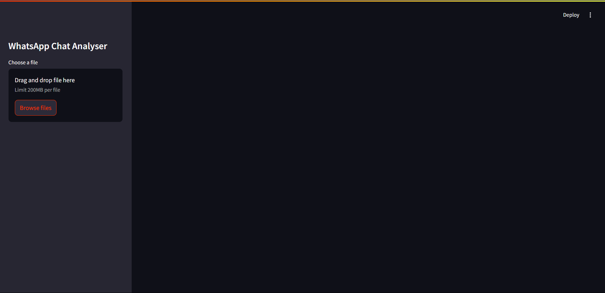
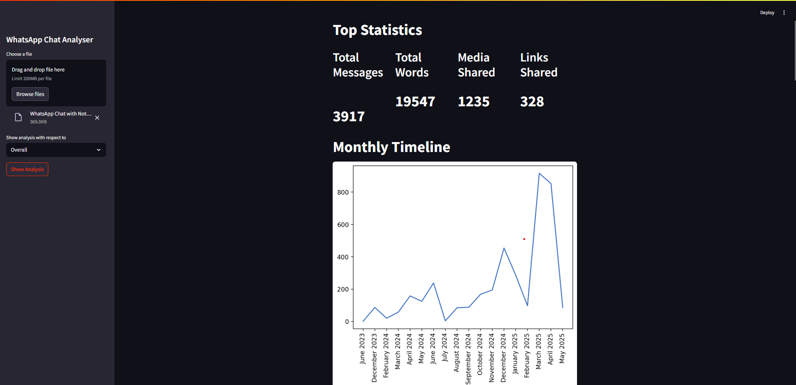
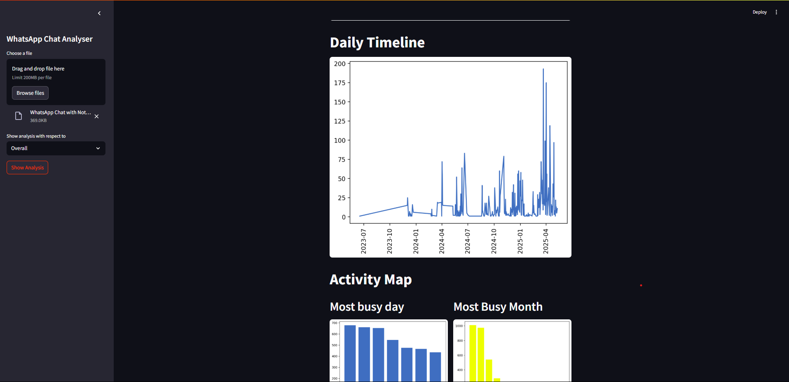
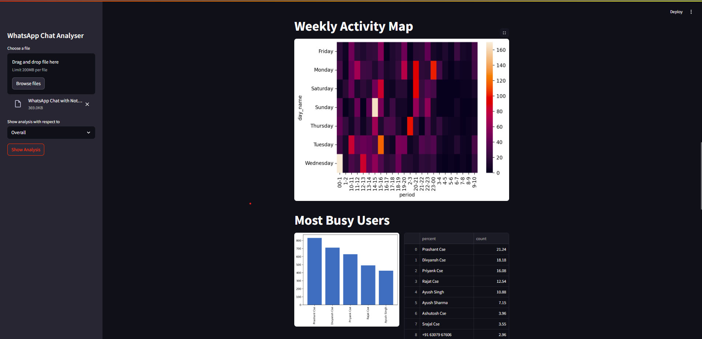
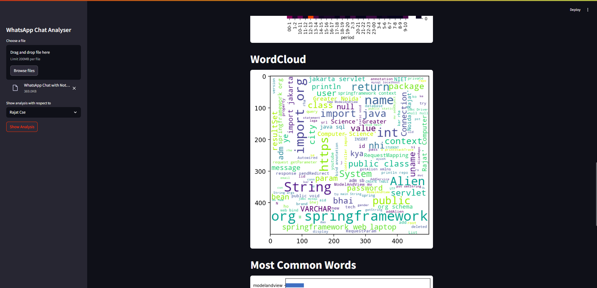
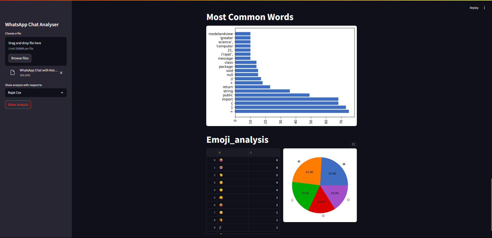

# WhatsApp Chat Analyzer

WhatsApp Chat Analyzer is a Streamlit-based web application for analyzing WhatsApp chat exports. It provides interactive statistics, visualizations, and insights about group or individual chat activity, word usage, emoji usage, and more.

---

## Features

- **Upload WhatsApp chat file** (text format)
- **User selection**: Analyze overall chat or filter by specific user
- **Top statistics**: Total messages, words, media, and links shared
- **Timelines**: Monthly and daily message activity
- **Activity maps**: Most active days, months, and heatmap of activity
- **Busiest users**: Identify most active participants (group level)
- **Word cloud**: Visualize most common words (with stopword removal)
- **Most common words**: Bar chart of top words
- **Emoji analysis**: Emoji usage statistics and pie chart

---

## Requirements

- Python 3.x
- See `requirements.txt` for all dependencies (notable: streamlit, pandas, matplotlib, seaborn, wordcloud, emoji, urlextract)

---

## How it Works

1. **Preprocessing**: Uploaded chat file is parsed and converted into a DataFrame (`preprocessor.py`).
2. **Analysis**: Various helper functions (`helper.py`) compute statistics, generate word clouds, extract emojis, and prepare data for visualization.
3. **Visualization**: Streamlit UI (`app.py`) displays statistics, charts, and tables interactively.

---

## Usage

1. Install dependencies:
   ```sh
   pip install -r requirements.txt
   ```
2. Run the app:
   ```sh
   streamlit run app.py
   ```
3. Open the web browser to the provided local URL.
4. Upload your WhatsApp chat export (text file).
5. Select user or "Overall" for group analysis.
6. Click "Show Analysis" to view results.

---

## File Structure

- `app.py` - Main Streamlit app
- `helper.py` - Analysis and visualization helper functions
- `preprocessor.py` - Chat file parsing and preprocessing
- `requirements.txt` - Python dependencies
- `stop_hinglish (1).txt` - Stopwords for word cloud filtering
- `render.yaml` - Deployment configuration (for Render.com or similar)

---

## Deployment

To deploy on a platform like Render, use the provided `render.yaml` file.

---

## License

This project is for educational and personal use.

---

## Screenshots

You can showcase your project by adding screenshots below:

<!-- Example screenshot usage. Place your images in a 'resources' folder at the same level as this README.md, or update the paths below as needed. -->







Replace `resources/A.png` with the actual path to your screenshot images if different.
